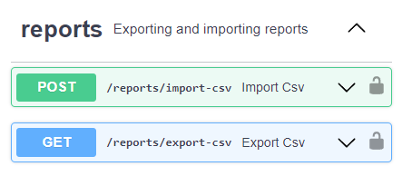

# Wallet FastAPI

Personal expense and income API service built using Python FastAPI.

## Overview

Registration and authorization with JWT


Authorization in Swagger UI


CRUD methods for wallet operations


Import and export CSV files



## Installation

Clone the repository and navigate to `src` directory:

```bash
git clone https://github.com/lesskop/wallet-fastapi.git
cd wallet-fastapi/src
```

### Using Docker

Use this command to build and start Docker container:

```bash
docker compose up -d
```

Swagger UI is available at <http://localhost:8000/docs>

### Without Docker

You need to have Python 3.9+ installed on your machine.

1. Create virtual environment (recommended):

```bash
python -m venv venv
```

2. Activate it:

- Windows

```bash
venv/Scripts/activate
```

- Linux

```bash
source venv/bin/activate
```

3. Install dependencies:

```bash
pip install -r requirements.txt
```

4. Run `wallet` module:

```bash
python -m wallet
```

Swagger UI is available at <http://localhost:8000/docs>

